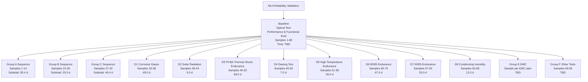

# MLA Environment Reliability Test Flow Chart Draft

## 1. 总表头建议

**项目**: MLA 环境可靠性测试  
**样品总量**: 已编号样品 `1-93`，其中常规环境可靠性主样品 `1-68`；`69-93` 用于 Other Tests；EMC 样品按 EMC 专项计划执行  
**测试组织方式**: `Baseline` 先做，`A/B/C/D/E/F` 分组展开，其中 `D` 为并行子组  
**项目总测试时间（当前草案口径）**:  
- `总排期时间（按并行执行）`: `>= 105.4 天 + EMC时长`
- `总测试工时累计（各组简单相加）`: `>= 518.8 天 + EMC时长`

说明:
- `总排期时间` 看的是项目从开始到结束需要多少自然天，适合做计划。
- `总测试工时累计` 看的是所有组别测试时长简单求和，适合做资源评估。
- 本版优先采用你确认的规则：`baseline optical = 7 天`、`post-group optical = 2 天`、`L1/L4 = A组3天，其他组2天`。
- 其余无法直接确认的项目，优先参考 `JLR L481 PV test timing plan-4.10.xls`。
- 少数项目会出现“标准理论时长”和“实验室 timing plan 天数”不一致，本版先按 timing plan 口径做排期。

## 2. 推荐版式

建议在 Excel 的 `Test Flow chart` 页顶端加一个总览区，然后下面按 `Baseline / Group A / Group B / Group C / Group D / Group E / Group F` 展开。  
每个组统一用 6 列：

| Seq | Test Item | Standard | Sample No. | Test Time (day) | Note |
|---|---|---|---|---:|---|

每组最后加一行：

| 组别小计 |  |  |  | X.X d | `已知小计` 或 `含TBD` |

## 3. Flow 结构草案

## 4. 分组明细草案

### Baseline

| Seq | Test Item | Standard | Sample No. | Test Time (day) | Note |
|---|---|---|---|---:|---|
| 1 | Optical Test | TPJLR-13-001 / STJLR.13.5009 | 1-68 | 7.0 | 你已确认：测试前统一测试 |
| 2 | Performance Evaluation & Functional Evaluation | TPJLR.18.125 L1/L4 | 1-68 | 3.0 | 按样本量较大口径先按 3d |
| Baseline 小计 |  |  |  | 10.0 | |

### Group A Sequence Tests

| Seq | Test Item | Standard | Sample No. | Test Time (day) | Note |
|---|---|---|---|---:|---|
| A1 | Particle Exposure | TPJLR.15.051 | 1-12 | 1.2 | 按标准估算，timing plan 未单列 |
| A2 | Low Temperature Exposure | K1 | 1-12 | 2.0 | 按 L481 timing plan |
| A3 | High Temperature Exposure | K2 | 1-12 | 2.0 | 按 L481 timing plan |
| A4 | Low Temperature Operation | K3 | 1-12 | 2.0 | 按 L481 timing plan |
| A5 | High Temperature Operation | K4 | 1-12 | 5.0 | 按 L481 timing plan |
| A6 | Temperature Step Test | K5 | 1-12 | 2.0 | 按 L481 timing plan |
| A7 | Powered Thermal Cycle | K6 | 1-12 | 11.0 | 按 L481 timing plan |
| A8 | Thermal Shock in Air | K7 | 1-12 | 14.0 | 按 L481 timing plan |
| A9 | Performance Evaluation & Functional Evaluation | L1/L4 | 1-12 | 3.0 | 你已确认：A组 3d |
| A10 | Vibration | K15 | 1-12 | 7.0 | 按 L481 timing plan |
| A11 | Mechanical Shock - Package Drop | K16.1 | 1-14 | 2.0 | 按 L481 timing plan |
| A12 | Mechanical Shock - Low | K16.4 | 1-12 | 2.0 | 按 L481 timing plan |
| A13 | Audible Noise | K17 | 1-12 | 10.0 | 按 L481 timing plan |
| A14 | Temperature/Humidity Cycle | K9 | 1-12 | 12.0 | 按 L481 timing plan |
| A15 | Water/Fluid Ingress Tests | K10 | 1-12 | 3.0 | 按 L481 timing plan |
| A16 | Dust Ingress | K13 | 1-12 | 5.0 | 按 L481 timing plan |
| A17 | Dust Blowing | K14 | 1-12 | 0.2 | 按标准估算，timing plan 未填 |
| A18 | Performance Evaluation & Functional Evaluation | L1/L4 | 1-12 | 3.0 | 你已确认：A组 3d |
| A19 | Optical Test | TPJLR-13-001 | 1-12 | 2.0 | 你已确认：测试后每组单独测 2d |
| A20 | Internal Inspection | L6 | 1-12 | 7.0 | 按 L481 timing plan |
| Group A 小计 |  |  |  | 95.4 | |

### Group B Sequence Tests

| Seq | Test Item | Standard | Sample No. | Test Time (day) | Note |
|---|---|---|---|---:|---|
| B1 | Chemical Resistance | K22 | 15-26 | 5.0 | 按 L481 timing plan |
| B2 | Connector and Lead/Lock Strength | K18 | 15-26 | 7.0 | 按 L481 timing plan |
| B3 | Performance Evaluation & Functional Evaluation | L1/L4 | 15-26 | 2.0 | 你已确认：除 A 外均 2d |
| B4 | Optical Test | TPJLR-13-001 | 15-26 | 2.0 | 你已确认：测试后每组单独测 2d |
| B5 | Internal Inspection | L6 | 15-26 | 4.0 | 按 L481 timing plan |
| Group B 小计 |  |  |  | 20.0 | |

### Group C Sequence Tests

| Seq | Test Item | Standard | Sample No. | Test Time (day) | Note |
|---|---|---|---|---:|---|
| C1 | Thermal Shock in Air | K7 | 27-32 | 14.0 | 按 L481 timing plan |
| C2 | Particle Exposure | TPJLR.15.051 | 27-32 | 1.2 | 按标准估算，timing plan 未单列 |
| C3 | Vibration | K15 | 27-32 | 4.0 | 按 L481 timing plan |
| C4 | Dust Ingress | K13 | 27-32 | 2.0 | 按 L481 timing plan |
| C5 | Dust Blowing | K14 | 27-32 | 0.2 | 按标准估算，timing plan 未填 |
| C6 | Mechanical Wear-Out | K26 | 27-32 | 23.0 | 按 L481 timing plan |
| C7 | Performance Evaluation & Functional Evaluation | L1/L4 | 27-32 | 2.0 | 你已确认：除 A 外均 2d |
| C8 | Optical Test | TPJLR-13-001 | 27-32 | 2.0 | 你已确认：测试后每组单独测 2d |
| C9 | Internal Inspection | L6 | 27-32 | 3.0 | 按 L481 timing plan |
| Group C 小计 |  |  |  | 49.4 | |

### Group D Parallel Tests

| Seq | Test Item | Standard | Sample No. | Test Time (day) | Note |
|---|---|---|---|---:|---|
| D1-1 | Corrosive Gases | K21 | 33-38 | 42.0 | 按 L481 timing plan |
| D1-2 | Performance Evaluation & Functional Evaluation | L1/L4 | 33-38 | 2.0 | 你已确认：除 A 外均 2d |
| D1-3 | Optical Test | TPJLR-13-001 | 33-38 | 2.0 | 你已确认：测试后每组单独测 2d |
| D1-4 | Internal Inspection | L6 | 33-38 | 3.0 | 按 L481 timing plan |
| D1 小计 |  |  |  | 49.0 | Samples = 6 |

| Seq | Test Item | Standard | Sample No. | Test Time (day) | Note |
|---|---|---|---|---:|---|
| D2-1 | Solar Radiation | K20 | 39-44 | 2.0 | 按 L481 timing plan |
| D2-2 | Performance Evaluation & Functional Evaluation | L1/L4 | 39-44 | 2.0 | 你已确认：除 A 外均 2d |
| D2-3 | Optical Test | TPJLR-13-001 | 39-44 | 2.0 | 你已确认：测试后每组单独测 2d |
| D2-4 | Internal Inspection | L6 | 39-44 | 3.0 | 按 L481 timing plan |
| D2 小计 |  |  |  | 9.0 | Samples = 6 |

| Seq | Test Item | Standard | Sample No. | Test Time (day) | Note |
|---|---|---|---|---:|---|
| D3-1 | Thermal Shock Endurance | K23 | 45-52 | 46.0 | 按 L481 timing plan |
| D3-2 | Performance Evaluation & Functional Evaluation | L1/L4 | 45-52 | 2.0 | 你已确认：除 A 外均 2d |
| D3-3 | Internal Inspection | L6 | 45-52 | 20.0 | 按 L481 timing plan |
| D3 小计 |  |  |  | 68.0 | Samples = 8, only PCBA |

| Seq | Test Item | Standard | Sample No. | Test Time (day) | Note |
|---|---|---|---|---:|---|
| D4-1 | Dewing Test | K8 | 45-50 | 2.0 | 按 L481 timing plan |
| D4-2 | Performance Evaluation & Functional Evaluation | L1/L4 | 45-50 | 2.0 | 你已确认：除 A 外均 2d |
| D4-3 | Internal Inspection | L6 | 45-50 | 3.0 | 按 L481 timing plan |
| D4 小计 |  |  |  | 7.0 | Samples = 6, only PCBA |

| Seq | Test Item | Standard | Sample No. | Test Time (day) | Note |
|---|---|---|---|---:|---|
| D5-1 | High Temperature Endurance | K24 | 51-56 | 42.0 | 按 L481 timing plan |
| D5-2 | Performance Evaluation & Functional Evaluation | L1/L4 | 51-56 | 2.0 | 你已确认：除 A 外均 2d |
| D5-3 | Optical Test | TPJLR-13-001 | 51-56 | 2.0 | 你已确认：测试后每组单独测 2d |
| D5-4 | Internal Inspection | L6 | 51-56 | 3.0 | 按 L481 timing plan |
| D5 小计 |  |  |  | 49.0 | Samples = 6 |

| Seq | Test Item | Standard | Sample No. | Test Time (day) | Note |
|---|---|---|---|---:|---|
| D6-1 | 85/85 High Temp High Humidity Endurance | K27 | 65-70 | 42.0 | 按 L481 timing plan |
| D6-2 | Performance Evaluation & Functional Evaluation | L1/L4 | 65-70 | 2.0 | 你已确认：除 A 外均 2d |
| D6-3 | Internal Inspection | L6 | 65-70 | 3.0 | 按 L481 timing plan |
| D6 小计 |  |  |  | 47.0 | Samples = 6 |

| Seq | Test Item | Standard | Sample No. | Test Time (day) | Note |
|---|---|---|---|---:|---|
| D7-1 | 60/95 High Temp High Humidity Endurance | K27 | 57-62 | 46.0 | 按 L481 timing plan |
| D7-2 | Performance Evaluation & Functional Evaluation | L1/L4 | 57-62 | 2.0 | 你已确认：除 A 外均 2d |
| D7-3 | Optical Test | TPJLR-13-001 | 57-62 | 2.0 | 你已确认：测试后每组单独测 2d |
| D7-4 | Internal Inspection | L6 | 57-62 | 3.0 | 按 L481 timing plan |
| D7 小计 |  |  |  | 53.0 | Samples = 6 |

| Seq | Test Item | Standard | Sample No. | Test Time (day) | Note |
|---|---|---|---|---:|---|
| D8-1 | HALT | K28 | 77-82 | No Test | 当前 flow chart 标记为 No Test |
| D8-2 | Performance Evaluation & Functional Evaluation | L1/L4 | 77-82 | No Test | |
| D8-3 | Optical Test | TPJLR-13-001 | 77-82 | No Test | |
| D8-4 | Internal Inspection | L6 | 77-82 | No Test | |
| D8 小计 |  |  |  | 0 | only PV |

| Seq | Test Item | Standard | Sample No. | Test Time (day) | Note |
|---|---|---|---|---:|---|
| D9-1 | Condensing Humidity | TPJLR.52.351 | 63-68 | 5.0 | 按标准 120h |
| D9-2 | Performance Evaluation & Functional Evaluation | L1/L4 | 63-68 | 2.0 | 你已确认：除 A 外均 2d |
| D9-3 | Optical Test | TPJLR-13-001 | 63-68 | 2.0 | 你已确认：测试后每组单独测 2d |
| D9-4 | Internal Inspection | L6 | 63-68 | 3.0 | 参考其他 D 组 L6 口径 |
| D9 小计 |  |  |  | 12.0 | Samples = 6 |

### Group E EMC Tests

| Seq | Test Item | Standard | Sample No. | Test Time (day) | Note |
|---|---|---|---|---:|---|
| E | EMC Test Plan | JLR-EMC-CS | Sample specified in EMC test plan | TBD | 仍建议单独挂 EMC 专项表，不和环境可靠性共用时长口径 |
| Group E 小计 |  |  |  | TBD | |

### Group F Other Tests

| Seq | Test Item | Standard | Sample No. | Test Time (day) | Note |
|---|---|---|---|---:|---|
| F1 | Restricted Substance Management | STJLR.99.9999 | Based on actual tests | 40.0 | 按 L481 timing plan |
| F2 | Operating Noise & Transient Noise | TPJLR.00.344 | 69-93 | 10.0 | 按 L481 timing plan |
| Group F 小计 |  |  |  | 50.0 | |

## 5. 我建议你在 Excel 里这样显示总计

### Header 总览

| Item | Value |
|---|---|
| Total Samples | 93 pcs + EMC dedicated samples |
| Baseline Samples | 1-68 |
| Group A | 14 pcs |
| Group B | 12 pcs |
| Group C | 6 pcs |
| Group D1-D9 | 56 pcs（分子组管理，存在不同编号段） |
| Group E | per EMC plan |
| Group F | 25 pcs |
| Total Elapsed Time | `>= 105.4 d + EMC` |
| Total Summed Test Time | `>= 518.8 d + EMC` |

## 6. 当前仍建议你确认的时长

下面这些项目我建议你再看一眼，确认是否接受当前口径：

- K14 Dust Blowing
- K20 Solar Radiation
- K21 Corrosive Gases
- K23 Thermal Shock Endurance
- EMC group duration
- D9 的 L6 我先按其他 D 组 3d 处理

## 7. 直接可转成 Excel 视觉稿的建议

- 顶部做一个横向总表头，放 `Total Samples / Total Elapsed Time / Total Summed Test Time`
- `Baseline` 单独一条横向泳道
- `A/B/C` 用横向串行块
- `D1-D9` 用 3x3 方阵块，更容易看出并行关系
- 每个块里固定三行: `Test name / Sample No. / Test Time`
- 每个大组底部单独一条 `Subtotal`
- `TBD` 用浅黄色底色，方便你后续补齐
